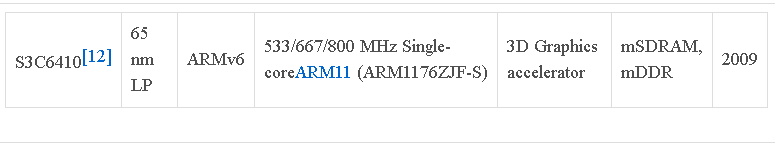
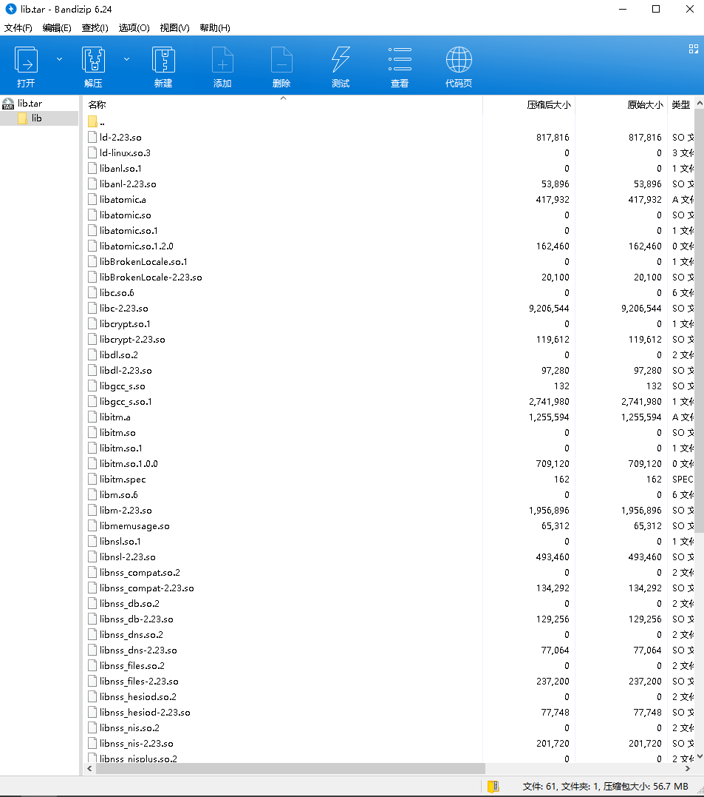
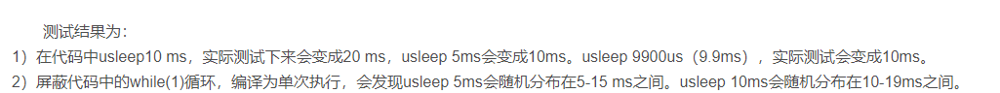

# 基于 OK6410-A arm嵌入式开发板的指令集级6052 CPU 模拟系统

* 文本主体由 Karen "the Fantasist" 生成。系统构建与队友 lhz(1900) 合作完成。

* 已取得队友授权，以CC-BY-NC-ND 4.0协议共享，发布到 LUG Planet。
 
* 与此同时，感谢 psi-cmd (1900) 的建议与支持。

* 万字长文，阅读需要花点时间 

***
<h3>目录</h3>
[TOC]

***

### 1. 背景 - 关于6502CPU的相关介绍
* 6502是著名的8位CPU，由MOS科技研发，曾用于Apple I、Apple II、FC（NES）等系统，在文曲星学习机等电子产品中也被广泛使用。

* 1975年下半年，6502开始发售，其设计目标是“一款比6800性能更好、价格更低的替代品”。其最大支持内存64KB，主频和6800一样，都是1MHz，但是因为6502有一个指令流水线，从而性能显著优于6800。而且由于对制程工艺的要求相对较低，造成6502的良品率出奇的高。

* 基于6502开发的Apple 1成功的让苹果电脑登上舞台，而KIM-1则帮助Commodore转战个人电脑市场。6502给当时执掌Commodore的Jack Tramiel留下了极其深刻的印象，并促使他收购MOS科技，从而为Commodore带来在个人电脑这一全新市场上的价格优势。

* Western Design Center在8-bit 6502的CMOS版本65C02的基础上，开发出了下一代的65C816 CPU。65816处理器完全向后兼容65C02，并包括了16-bit支持和24-bit内存寻址空间，使其可以跨越64KB的限制并访问最高16MB的系统内存。（与Intel 80286类似）

* 从1976年到1990年代，6502架构对个人电脑行业产生了相当深刻的影响，这种影响力一直持续到Commodore关门停业、Atari离开8-bit市场、苹果停产Apple II产品线、游戏机行业从SNES转向第五代游戏机等一系列剧变之后。

* 从诞生至今的数十年来，6502对个人电脑和家用游戏主机行业产生了极其深刻的影响，无数人的人生因此而改变。虽然NES早已停产，文曲星早已经不再流行，但直到现在，6502仍被运用于数以亿计的工业监测和控制计算机。基于6502指令集开发的汇编代码应用也是我们的宝贵财富。

### 2. 开发环境

#### 测试机
  + Windows10 21H2 64bit
    + Windows Subsystem for Linux 
      + OS: Ubuntu 20.04 LTS
      + Kernel：5.9.0，自定义内核，基于microsoft-standard-WSL2魔改）
    + 代码编辑：Windows平台下的VS Code
#### 开发机
  + Windows11 抢先体验版
    + Windows Subsystem for Linux 
      + OS： Arch Linux on Windows 10 x86_64
      + Kernel：5.10.60.1-microsoft-standard-WSL2
    +  代码编辑：Windows平台下的VS Code
#### 目标机
  + 嵌入式开发板：OK6410 
    + Kernel: 后续生成
    + 文件系统：后续生成
    + 串口调试： MobaXterm 
***
### 3. 完成OK6410本机对硬浮点数的支持
#### 3.1 硬浮点数介绍
##### 硬浮点(hard)

* 编译器将代码直接编译成硬件浮点协处理器(浮点运算单元FPU)能识别的指令，这些指令在执行的时候ARM核直接把它转给协处理器执行。FPU 通常有一套额外的寄存器来完成浮点参数传递和运算。使用实际的硬件浮点运算单元(FPU)会带来性能的提升

##### 软浮点(soft)
编译器把浮点运算转成浮点运算的函数调用和库函数调用(即用整数运算模拟浮点运算)，没有FPU的指令调用，也没有浮点寄存器的参数传递。浮点参数的传递也是通过ARM寄存器或者堆栈完成。现在的Linux系统默认编译选择使用hard-float,如果系统没有任何浮点处理器单元，这就会产生非法指令和异常。因而一般的系统镜像都采用软浮点以兼容没有VFP的处理器。
##### 介于二者之间的soft-fp
armel架构(对应的编译器为gcc-arm-linux-gnueabi)采用的默认值。用fpu计算，但是传参数用普通寄存器传，这样中断的时候，只需要保存普通寄存器，中断负荷小，但是参数需要转换成浮点的再计算。
#####  ARM软浮点与硬浮点编译
出于低功耗、封装限制等种种原因，以前的一些ARM处理器没有独立的硬件浮点运算单元，需要用软件来实现浮点运算。随着技术发展，现在高端的ARM处理器基本都具备了硬件执行浮点操作的能力。新旧两种架构之间的差异，就产生了两个不同的接口–软浮点与硬浮点。
##### 硬浮点的使用条件:
想要使用硬浮点数来帮助浮点运算。需要以下几个前提条件：
1. 硬件本身存在浮点计算单元，也即硬浮点协处理器。
	+ 没有浮点计算单元，自然不可能使用硬浮点。
2. Kernel中设置支持硬件协处理器。
    + 如果Kernel不支持浮点协处理器，则因为协处理器寄存器等使用权限等问题，协处理器对应指令无法运行。
3. 编译器支持将浮点运算翻译成硬件浮点运算指令，或者在需要浮点运算的时候手动调用相应的浮点运算指令。
    + 编译器可以显式指定将浮点运算翻译成何种浮点指令。
    + 如果编译器支持软浮点，则其可能会将浮点运算翻译成编译器中自带的浮点库。则不会有真正的浮点运算。
        + 否则，可以翻译成FPA(Floating Point Accelerator)指令。 FPA指令再去查看是否有浮点模拟器。还可以将浮点运算指定为VFP（vector floating point）指令或者neon向量浮点指令。

#### 3.2 研究原装飞凌OK6410系统对硬浮点数的支持
* 在前期的验证试验中，我们已经证明了软链接glibc库在交叉编译器arm-gcc 4.8.3上可以使用，但在编译时加入static选项以后却会出现Illegal Instruction。
* 我们这里猜测是因为飞凌官方提供并稳定支持的Linux内核(最高版本为3.0.1)不支持硬浮点数。
    + 然而在查询开源文档之后，我们发现OK6410的中央处理器-S3C6410实际上在硬件上有硬浮点计算单元。(如下文)
 
	图1，OK6410带有ARM1176JZF-S核心
 

而该核心为ARMv6架构。

如图所示为ARM1176JZF-S核心支持的feature：
 
+ 如上文高亮可得， ARM1176JZF-S存在VFP计算单元。

以上，我们这里有了重新构建整个系统，以令OK6410目标机支持硬浮点的可能。我们将在下面完成OK6410对硬浮点数的支持。

#### 3.3 完成OK6410对硬浮点数的支持
	
    
* 这里使用了飞凌官方提供的Linux-3.0.1源码，尝试进行交叉编译
* 首先使用的是arm-gcc 4.8.3，最终结果卡住在内核解压(Starting Kernel)，多次编译启动失败，无果。
* 最后查询多方资料，参考官方文档提供的信息，我们换用了光盘内提供的，更低版本的arm-gcc-4.3.2交叉编译器以构建整个内核。

对飞凌官方提供的Linux-3.0.1修改的重要配置如图所示：
 
	
然而，在编译Linux内核过程中时出现了以下错误提示：

    Can't use 'defined(@array)' (Maybe you should just omit the defined()?) at kernel/timeconst.pl line 373.

细究原因，查询多方资料后定位错误信息。

我们删掉了kernel/timeconst.pl 文件中 373行的
    
    if (!defined(@val)) {

并修改为

    if (!@val) {

后，编译成功。

然后，重新刷写内核，启动开发板。
	
启动成功，显示如图：

### 4. uboot与文件系统的刷写
我们这里考虑到垃圾飞凌嵌入式的OK6410电子垃圾开发板，神奇

### 5. 对开发板的内核升级
#### 关于Linux内核
* 从2004年2.6.0版本开始，使用一种“time-based”的方式。3.0版本之前，是一种“A.B.C.D”的格式。七年里，前两个数字A.B即“2.6”保持不变，C随着新版本的发布而增加,D代表一些bug修复，安全更新，添加新特性和驱动的次数。3.0版本之后是“A.B.C”格式，B随着新版本的发布而增加,C代表一些bug修复，安全更新，新特性和驱动的次数。
* 升级kernel主要目的在于解决linux的兼容性问题。我们希望利用支持更多特性的、现代的硬件(比如手头的无线网卡)，而这需要更新版本的Kernel，故而，我们这里尝试升级Kernel。

#### 研究将OK6410进行内核升级的可行性

* Linux内核在很早以前就取消了官方对yaffs2文件系统的支持
* 迄今为止，我们并未在互联网上的面向OK6410开发板的开源内核系统升级中发现yaffs2文件系统支持。
甚至在Github最高star的开源文献——最高稳定发布版本为Linux-3.12，目前master源代码版本为Linux-4.1，也是文档写得最详细的关于OK6410 Linux Kernel的Github开源项目——明确说明不支持yaffs/yaffs2文件系统。(如下图所示)
	 

然而我们真的相当需要yaffs2文件系统——yaffs2文件系统从设计之初就特供嵌入式系统，对资源有限的嵌入式系统进行了特别的优化。

#### 数次失败的体验

##### 修复Kernel Panic做出的努力

* 我们尝试为我们选用的Linux内核打上yaffs2文件系统的补丁，并成功出现linux内核输出。但结果我们又发现由于开发板上旧版本的Samsung NAND驱动在高版本linux内核下存在严重问题，会导致Kernel Panic，以我们二人的力量在有限的时间内无法解决该问题。如下图所示：
  
* 受到个人能力的限制，我们也不可能对驱动进行更多地操作。
* 我们最终无奈放弃该计划。

内核移植计划宣告失败。

### 6.本机编译安装最新的交叉编译器gcc 
#### 升级gcc的理由
+ 为硬浮点数的支持：
    + 参考前文“硬浮点的使用条件”，我们需要更新的原生支持硬浮点的gcc编译器(后缀为gnueabihf)。

+ 为C++新特性的支持：
    + 我们预估将来可能会需要写一些C++代码，而老旧的arm-gcc 4.8.3交叉编译器仅支持到C++11（甚至还不全），不支持更新的C++特性，这会为开发带来困难。

* 为更新的代码优化与调试：
    + 新版的gcc代码调试体验更加舒适，代码优化也更出色，我们期待更新的代码优化调试功能可以降低我们移植6502指令集带来的性能损失。

#### 在本机安装交叉编译器arm-gcc-11.2(gnueabihf)
* 这里参考了https://crosstool-ng.github.io/docs的资料。
* 如图所示，我们下载crosstool-ng并解压安装，然后修改配置如图：
    + (我们修改了大量的配置，以尽可能与我们的目标机相贴合，配置放图较多)
	

+  关键要点：glibc2.23；vfp；GCC11.2；Linux Version：2.6.32.71；Assembly：arm1176jvf-s

 

 

 
 
* 然后build

 

* 等待大约90min后，所有程序就绪，编译安装完成，如图。
 
 
至此，我们成功在本机安装了支持硬浮点的arm-gcc-11.2，作为我们的开发环境
#### 参考步骤
	可以在浏览器中访问https://github.com/crosstool-ng/crosstool-ng/archive/refs/heads/master.zip
直接从github上下载crosstool-ng的最新版，下载得到文件crosstool-ng-master.zip 

下载后，在文件下载目录处执行
    
    unzip -q crosstool-ng-master.zip
解压文件
解压得到crosstool-ng-master文件夹，cd进入该目录，然后执行：
	
    ./configure --prefix= (你想要crosstool-ng安装的位置)
    make
    make install
cd进入到(你想要crosstool-ng安装的位置)，然后执行：
	
    ./ct-ng menuconfig
修改配置文件完成后，执行
    
    ./ct-ng build
安装完成后的交叉编译器一般位置在：
    
    你想要crosstool-ng安装的目录/../../x-tools 

目录下。

另注：你可以使用
    
    ./ct-ng arm-unknown-linux-gnueabi
命令加载默认的配置，与自己的配置作比较，可以极大简化配置文件修改的难度。

### 7.为OK6410升级最新的glibc库
#### Glibc库初探
* glibc是GNU发布的libc库，即c运行库。glibc是linux系统中最底层的api，几乎其它任何运行库都会依赖于glibc。glibc除了封装linux操作系统所提供的系统服务外，它本身也提供了许多其它一些必要功能服务的实现。由于 glibc 囊括了几乎所有的 UNIX 通行的标准，可以想见其内容包罗万象。而就像其他的 UNIX 系统一样，其内含的档案群分散于系统的树状目录结构中，像一个支架一般撑起整个操作系统。在 GNU/Linux 系统中，其C函式库发展史点出了GNU/Linux 演进的几个重要里程碑，用 glibc 作为系统的C函式库，是GNU/Linux演进的一个重要里程碑。
* glibc是一种按照LGPL许可协议发布的，自由的，公开源代码的，方便从网络下载的C的编译程序。GNU C运行期库，是一种C函数库，是程序运行时使用到的一些API集合，它们一般是已预先编译好，以二进制代码形式存在Linux类系统中，GNU C运行期库通常作为GNU C编译程序的一个部分发布。
glibc最初是自由软件基金会（FSF）为其GNU操作系统所写，但当前最主要的应用是配合Linux内核，成为GNU/Linux操作系统一个重要的组成部分。

#### 关于OK6410的原装Glibc库
如图所示，飞凌官方提供的原装文件系统源码，glibc版本为2.8。
 
我们这里查询glic文档以获取更多的信息：
 
如图所示，Glibc2.23是我们已有的Linux 3.0.1内核能支持的最高版本。
故而在这里，我们选择尝试升级glibc依赖库到2.23，以支持更新的优化过的特性。
#### 完成开发板系统的glibc库的升级
	我们发现，在“Branch3本机编译安装最新的交叉编译器gcc”步骤时，在本机已经生成好了我们需要的lib库。
我们只需要在这基础上做一定的加工，对glibc库进行打包安装即可。
如下图，我们成功检索并打包好了lib.tar
 
然后直接将所有文件释放到busybox根文件系统的/lib文件夹中，使用飞凌给出的Yaffs2文件系统生成文件即可。
如图所示，成功打包：

升级成功如下图所示

### 8. OK6410上的软件模拟6502指令集系统构建
#### 8.1 关于开发的理论要点：
##### 8.1.1 关于显示屏
###### 关于FrameBuffer—— 原理、实现与应用
   * FrameBuffer 是出现在 2.2.xx 内核当中的一种驱动程序接口。
   * Linux是工作在保护模式下，所以用户态进程是无法象DOS那样使用显卡BIOS里提供的中断调用来实现直接写屏，Linux抽象出FrameBuffer这个设备来供用户态进程实现直接写屏。Framebuffer机制模仿显卡的功能，将显卡硬件结构抽象掉，可以通过Framebuffer的读写直接对显存进行操作。用户可以将Framebuffer看成是显示内存的一个映像，将其映射到进程地址空间之后，就可以直接进行读写操作，而写操作可以立即反应在屏幕上。这种操作是抽象的，统一的。用户不必关心物理显存的位置、换页机制等等具体细节。这些都是由Framebuffer设备驱动来完成的。
     + 但Framebuffer本身不具备任何运算数据的能力,就只好比是一个暂时存放水的水池.CPU将运算后的结果放到这个水池,水池再将结果流到显示器.中间不会对数据做处理. 应用程序也可以直接读写这个水池的内容.在这种机制下，尽管Framebuffer需要真正的显卡驱动的支持，但所有显示任务都有CPU完成,因此CPU负担很重.

* framebuffer的设备文件一般是 /dev/fb0、/dev/fb1 等。

可以用命令: 
    
    #dd if=/dev/zero of=/dev/fb 清空屏幕.

如果显示模式是1024x768-8 位色，用命令：
    
    dd if=/dev/zero of=/dev/fb0 bs=1024 count=768 清空屏幕；
用命令: 
    dd if=/dev/fb of=fbfile  
可以将fb中的内容保存下来；
可以使用命令重新写回屏幕: 
    
    dd if=fbfile of=/dev/fb；
在使用Framebuffer时，Linux将显卡置于图形模式下．
在应用程序中，一般通过将FrameBuffer 设备映射到进程地址空间的方式使用：打开/dev/fb0 设备，通过 mmap 系统调用进行地址映射，随后用 memset 将屏幕清空，如下所示：

    int fb;
    unsigned char* fb_mem;
    fb = open ("/dev/fb0", O_RDWR);
    fb_mem = mmap (NULL, 1024*768,PROT_READ|PROT_WRITE,MAP_SHARED,fb,0);
    memset (fb_mem, 0, 1024*768);

FrameBuffer 设备还提供了若干 ioctl 命令，通过这些命令，可以获得显示设备的一些固定信息（比如显示内存大小）、与显示模式相关的可变信息（比如分辨率、象素结构、每扫描线的字节宽度），以及伪彩色模式下的调色板信息等等。
    通过FrameBuffer 设备，还可以获得当前内核所支持的加速显示卡的类型（通过固定信息得到），这种类型通常是和特定显示芯片相关的。比如在Linux Kernel 2.4.9中，就包含有对 S3、Matrox、nVidia、3Dfx 等等流行显示芯片的加速支持。在获得了加速芯片类型之后，应用程序就可以将 PCI 设备的内存I/O（memio）映射到进程的地址空间。这些 memio 一般是用来控制显示卡的寄存器，通过对这些寄存器的操作，应用程序就可以控制特定显卡的加速功能。
   PCI 设备可以将自己的控制寄存器映射到物理内存空间，而后，对这些控制寄存器的访问，给变成了对物理内存的访问。因此，这些寄存器又被称为"memio"。一旦被映射到物理内存，Linux 的普通进程就可以通过 mmap 将这些内存 I/O 映射到进程地址空间，这样就可以直接访问这些寄存器了。
    当然，因为不同的显示芯片具有不同的加速能力，对memio的使用和定义也各自不同，这时，就需要针对加速芯片的不同类型来编写实现不同的加速功能。比如大多数芯片都提供了对矩形填充的硬件加速支持，但不同的芯片实现方式不同，这时，就需要针对不同的芯片类型编写不同的用来完成填充矩形的函数。
   FrameBuffer 只是一个提供显示内存和显示芯片寄存器从物理内存映射到进程地址空间中的设备。所以，对于应用程序而言，如果希望在 FrameBuffer 之上进行图形编程，还需要自己动手完成其他许多工作。
###### 8.1.2 ioctl()、mmap()、memset()函数详解
ioctl是设备驱动程序中对设备的I/O通道进行管理的函数。所谓对I/O通道进行管理，就是对设备的一些特性进行控制，例如串口的传输波特率、马达的转速等等(自然也包括显示屏的颜色)。它的调用如下：

    int ioctl(int fd, ind cmd, …)；
其中fd是用户程序打开设备时使用open函数返回的文件标示符，cmd是用户程序对设备的控制命令，至于后面的省略号，那是一些补充参数，一般最多一个，这个参数的有无和cmd的意义相关。
ioctl函数是文件结构中的一个属性分量，就是说如果你的驱动程序提供了对ioctl的支持，用户就可以在用户程序中使用ioctl函数来控制设备的I/O通道。

mmap将一个文件或者其它对象映射进内存。文件被映射到多个页上，如果文件的大小不是所有页的大小之和，最后一个页不被使用的空间将会清零。mmap在用户空间映射调用系统中作用很大。
函数原型：

	void* mmap(void* start,size_t length,int prot,int flags,int fd,off_t offset);

memset是计算机中C/C++语言初始化函数。作用是将某一块内存中的内容全部设置为指定的值， 这个函数通常为新申请的内存做初始化工作。它是对较大的结构体或数组进行清零操作的一种最快方法
函数原型：extern void *memset(void *buffer, int c, int count)
buffer：指针或数组	c：赋给buffer的值	count：buffer的长度.

我们可以调用这三个函数来对屏幕进行绘制。
###### 8.1.3 飞凌嵌入式OK6410默认屏幕的参数
	经测试，飞凌开发板的默认的屏幕硬件位置为/dev/fb0，屏幕每个像素点的大小均为16bit，我们可以直接在代码中固定参数，以简化代码，避免做兼容性给自己凭空增加难度。
	飞凌屏幕的参数可以通过调用查询fb_var_screeninfo 结构体得到。
##### 8.1.2 关于键盘
###### 8.1.2.1 linux键盘input_event浅析
查询#include <linux/input.h>，我们可以得到input_event结构体的详细信息

    struct input_event {
        struct timeval time;
        __u16 type;
        __u16 code;
        __s32 value;
    };
	Timeval：输入时间 
    Type：输入类型(我们目前只需要EV_KEY类型的输入)
    Code：输入代号(针对键盘输入而言，即每个字符的代号，如KEY_A	(KEY类型的A字符输入)代号为30)
    Value：输入代码(针对键盘而言，0：释放按钮 1：按下按钮 2：长按按钮)

* 设备有着自己特殊的按键键码，我需要将一些标准的按键，比如0－9，X－Z等模拟成标准按键，比如KEY_0,KEY-Z等，所以需要用到按键模拟，具体 方法就是操作 /dev/input/event* 文件，向它写入个input_event结构体即可模拟按键输入。

###### 8.1.2.2 关于OK6410的键盘input_event
* 经测试，有线的，USB2.0接口的键盘可以被OK6410识别，加载至/dev/input/event3下。我们可以直接打开该文件以调用input_event的输出。
##### 8.1.3 代码结构总览
 
我们以下给出大致注释：

    LiteNES
    ├── include  头文件库
    │   ├── *common.h 
    │   ├── *cpu-internal.h 
    │   ├── *cpu.h
    │   ├── *fce.h
    │   ├── *hal.h
    │   ├── *memory.h 
    │   ├── *mmc.h 
    │   ├── *nes.h
    │   ├── *ppu-internal.h
    │   ├── *ppu.h
    │   └── *psg.h
    ├── src 源码
    │   ├── fce
    │   │   ├── *common.c 一些方便的操作的集合(读写数据操作的优化)
    │   │   ├── *cpu-addressing.c  CPU的取址译码器虚拟化
    │   │   ├── +cpu-internal.c  对cpu-internal.h的调整
    │   │   ├── *cpu.c  CPU的核心ALU虚拟化
    │   │   ├── *fce.c 外接电路虚拟化
    │   │   ├── *memory.c内存虚拟化
    │   │   ├── *mmc.c 插件控制器(包括显示屏控制)
    │   │   ├── *ppu.c 物理运算处理器(游戏必备的物理碰撞计算需要调用ppu)
    │   │   └── *psg.c 时序信号发生器
    │   ├── **hal.c 硬件抽象层文件
    │   └── **main.c 打开程序最先执行的代码，
    └── +xmake.lua 工程描述
    备注：
        标明*的文件即为我们修改/添加过的源码文件。
    标明**的文件即为我们着力修改过的源码文件。
    标明+的文件是我们新增的文件。
    注意：我们精简包删除的文件在这里并未涉及。
由此我们可大致整理出NES红白机的体系结构。

#### 8.2 编译过程中面临的问题
##### 8.2.1 编译器由于多重定义报错的问题。
如在原本代码中的cpu-internal.h内有代码如图：
 

cpu-internal.h修改如下所示：

    extern CPU_STATE cpu;
    extern byte CPU_RAM[0x8000];
    extern byte op_code;             // Current instruction code
    extern int op_value, op_address; // Arguments for current instruction
    extern int op_cycles; // Additional instruction cycles used (e.g. when paging occurs)

    extern unsigned long long cpu_cycles; // Total CPU Cycles Since Power Up (wraps)

    extern void (*cpu_op_address_mode[256])(); // Array of address modes
    extern void (*cpu_op_handler[256])(); // Array of instruction function pointers
    extern bool cpu_op_in_base_instruction_set[256]; // true if instruction is in
                                                     // base 6502 instruction set
    extern char *cpu_op_name[256];                   // Instruction names
    extern int cpu_op_cycles[256]; // CPU cycles used by instructions

* 令在同名.c 文件中重新定义该变量(当同名.c 文件不存在时，创建之)。
* 其他文件修改同理。我们修改了几乎所有的文件。	
##### 8.2.2 多人游戏的实现：
* 我们查询资料，发现若要实现任天堂红白机的双人模式，需要查询第二个玩家的输入设备内存地址定义

* 任天堂红白机的内存输入定义资料如下图所示：
 
玩家1：Joypad1，占用地址4016；玩家2：Joypad2，占用地址4017.

故而我们这样修改代码

        inline byte psg_io_read(word address) {
            if (address == 0x4016) {
                if (p++ < 9) {return nes_key_state(p, 0/*也即player0*/);}
            } else if (address == 0x4017) {
                if (p++ < 9) {return nes_key_state(p, 1/*也即player1*/);}
            }
            return 0;
        }
        inline void psg_io_write(word address, byte data) {
            if (address == 0x4016) {
                if ((data & 1) == 0 && prev_write == 1) {p = 0;}
            } else if (address == 0x4017) {
                if ((data & 1) == 0 && prev_write == 1) {p = 0;}
            }
            prev_write = data & 1;
        }

##### 8.2.3 画面抖动的解决
    	我们发现代码初步完成以后直接运行，画面存在相当严重的抖动
    	故而这里在显示屏初始化lcd_fb_init()函数中加入一个fb_buffer：
    fb_buffer = (uint16_t *)calloc(vinfo.xres * vinfo.yres, sizeof(uint16_t));
    	缓存画面，以避免过快的直接刷写，造成显示器严重的画面抖动。
#### 8.3.关于键盘支持的补充说明
详情参见我们的源码附录hal.c。
如图，输出调试信息，说明我们的键盘成功运行(成功被读入)。
（注：源码中输出调试的代码已被我们删除）
 
至此，我们成功将外接键盘接被我们的虚拟机成功识别。
#### 8.4.关于显示屏的支持的补充说明
详情参见我们的源码附录hal.c。
另外，我们发现：我们自己写的显示与QT2.2存在部分冲突。我们最终尝试摒弃QT2.2，拥抱busybox根文件系统以提升我们的虚拟机的运行效率。
#### 8.5.参考编译步骤
*	解压文件包，在文件目录下执行如下命令(需要xmake与x-tools交叉编译器的支持)：

        xmake f -p cross --sdk=~/x-tools/arm-unknown-linux-gnueabihf
        xmake

* 编译出的可执行文件位于 build/cross/arm/release/目录下，文件名为litenes

#### 8.6. 附录——对关键代码hal.c的注释。
以下为对hal.c的源码这——开发的主要工作——的详细分析。。
我们这里魔改了github上原有的开源代码，完全避免了Allegro图形库的使用。

##### 头文件区：
很明显，Allegro库的调用已被我们全部删除。

    #include "hal.h"
    #include "common.h"
    #include "fce.h"
    #include <fcntl.h>
    #include <linux/fb.h>
    #include <linux/input.h>
    #include <linux/kd.h>
    #include <linux/vt.h>
    #include <sched.h>
    #include <signal.h>
    #include <stdbool.h>
    #include <stdint.h>
    #include <stdio.h>
    #include <stdlib.h>
    #include <string.h>
    #include <sys/ioctl.h>
    #include <sys/mman.h>
    #include <time.h>
    #include <unistd.h>

##### 显示屏调用区：
    struct fb_var_screeninfo vinfo;
    uint16_t *fb;
    uint16_t *fb_buffer;
    bool keys[KEY_MAX] = {0};
    void lcd_fb_display_px(pal pal, int x, int y) {//屏幕输出
        if (x < 0 || x >= SCREEN_WIDTH || y < 0 || y >= SCREEN_HEIGHT) {
            return;
        }
        x += (vinfo.xres - SCREEN_WIDTH) / 2;
        y += (vinfo.yres - SCREEN_HEIGHT) / 2;
        buffer[x + y * vinfo.xres] =
        (pal.r >> 3) << 11 | (pal.g >> 2) << 5 | pal.b >> 3;
     //色彩格式：2字节，16bit红5绿6蓝5
    }
    int lcd_fb_init() {//初始化屏幕，理论同branch5 1.1 2
    int fd = open("/dev/fb0", O_RDWR);
        if (fd < 0) {
            perror("open lcd fb failed");
            return 1;
        }
        if (ioctl(fd, FBIOGET_VSCREENINFO, &vinfo)) {
            close(fd);
            perror("ioctl FBIOGET_VSCREENINFO failed");
            return 1;
        }
    uint32_t screen_size = vinfo.bits_per_pixel / 8 * vinfo.xres * vinfo.yres;
    //注意：查询屏幕参数可知，该屏幕的RGB颜色需要16bit空间，故而以下全部使用uint16_t
        fb = (uint16_t *)mmap(NULL, screen_size, PROT_READ | PROT_WRITE, MAP_SHARED,
                              fd, 0);
        if (fb == MAP_FAILED) {
            close(fd);
            perror("map failed");
            return 1;
        }
        memset(fb, 0, screen_size);
        fb_buffer = (uint16_t *)calloc(vinfo.xres * vinfo.yres, sizeof(uint16_t));
        if (!fb_buffer) {
            perror("bad allocation");
            return 1;
        }
        return 0;
    }
##### 键盘调用区：
    int keyboard(void *_) {
    int fd = open("/dev/input/event3", O_RDONLY);
    //经测试确认event3在OK6410中代表了键盘
        if (fd < 0) {
            perror("can't open input device");
            return 1;
        }
    struct input_event ev[64];
    //开一个64大小的键盘缓冲区，保存一定时间内输入的键盘按键
    while (true) {
    //循环写死，获取资源
            int rd = read(fd, ev, 64 * sizeof(struct input_event));
            if (rd < (int)sizeof(struct input_event)) {
                perror("error reading");
                return 1;
            }
            for (int i = 0; i < rd / sizeof(struct input_event); ++i) {
                if (ev[i].type != EV_KEY) {
                    continue;
                }
    //识别输入 
                switch (ev[i].value) {
                case 0:
                    keys[ev[i].code] = false;
                    break;
                case 1:
                    keys[ev[i].code] = true;
                    if (ev[i].code == KEY_ESC) {
                        kill(0, SIGINT);
                        return 1;
                    }
                    break;
                }
            }
        }
        return 0;
    }
    
    
    
    
##### 接口区：

    /* Wait until next allegro timer event is fired. */
    void wait_for_frame() { usleep(1000000/FPS); }
画面一次刷新时间为1000000 / FPS (单位：us) ≈17ms。这里直接使用了一个usleep函数。
但是实测刷新时间总是偏长。
经查询资料，我们发现了问题：
    
    
画面一次刷新时间为1000 / FPS(单位：ms)，恰好和usleep函数上下文切换时间相差不大。这便是我们为什么这里直  接使用usleep函数出现了问题。
最终我们还是引入了time.h，并修改了源码：

最终测试顺利通过。
    

* 这一段是颜色设置。

        void nes_set_bg_color(int c) {
            for (int x = 0; x < SCREEN_WIDTH; ++x) {
                for (int y = 0; y < SCREEN_HEIGHT; ++y) {
                    lcd_fb_display_px(palette[c], x, y);
                }
            }
        }

* 这一段是对缓存空间的刷新操作
  
        void nes_flush_buf(PixelBuf *buf) {
                for (int i = 0; i < buf->size; ++i) {
                Pixel *p = &buf->buf[i];
                lcd_fb_display_px(palette[p->c], p->x, p->y);
            }
        }
    
* 注意clone_flags与clone函数：其实是实现了pthread中的一个函数——开了一个线程，获取键盘输入
  这里直接写代码以完成开线程的操作。

        void nes_hal_init() {
            if (lcd_fb_init()) {//设置时钟
                perror("lcd fb init error");
                return;
            }
            const unsigned stack_size = 1048576; 
        char *stack = (char *)malloc(stack_size); 
        //分了一个绝对充足的栈空间，降低了栈溢出的可能
            if (!stack) {
                perror("bad allocation");
            }
            const int clone_flags = CLONE_VM | CLONE_FS | CLONE_FILES | CLONE_SIGHAND |
                                    CLONE_THREAD | CLONE_SETTLS | CLONE_PARENT_SETTID |
                                    CLONE_CHILD_CLEARTID | CLONE_SYSVSEM;
            clone(keyboard, stack + stack_size, clone_flags, NULL);
        }

* 这一段代码的作用是：将fb_buffer中的数据复制到显存中。
  
        void nes_flip_display() {
            memcpy(fb, fb_buffer, vinfo.xres * vinfo.yres * sizeof(uint16_t));
        }

* 键盘输入判断：

        int nes_key_state(int b, bool c) {
            switch (b) {
            case 0: // On / Off
                return 1;
            case 1: // A
                return c ? keys[KEY_KP2] : keys[KEY_K];
            case 2: // B
                return c ? keys[KEY_KP1] : keys[KEY_J];
            case 3: // SELECT
                return c ? keys[KEY_KP4] : keys[KEY_U];
            case 4: // START
                return c ? keys[KEY_KP5] : keys[KEY_I];
            case 5: // UP
                return c ? keys[KEY_UP] : keys[KEY_W];
            case 6: // DOWN
                return c ? keys[KEY_DOWN] : keys[KEY_S];
            case 7: // LEFT
                return c ? keys[KEY_LEFT] : keys[KEY_A];
            case 8: // RIGHT
                return c ? keys[KEY_RIGHT] : keys[KEY_D];
            default:
                return 0;
            }
        }
### 9. 事后分析

#### 难度评估
* 运维测试的难度主要在于：
  * 过于古旧的OK6410嵌入式开发机的开发文档不太完善、中文文档开源系统过于混乱无序以及英文开源文档的语言门槛，这对信息检索归纳能力有相当的要求；
  * 需要对Linux Kernel、uboot、文件系统等结构有足够强的认知能力，这是对操作系统、体系结构知识的一次相当严肃的考验。
* 开发的主要难度在于：
  * 对工具链与程序设计语言(这里使用了难度颇高的C/C++)本身的熟练使用，而这是对程序设计的实践；
  * 对指令集系统的深入了解，这是对组成原理、体系结构知识的一次完整的测试；
  * 关于嵌入式系统开发本身，也是对汇编语言的全面复习。
···

* 与此同时，无数次make不过、ERROR刷屏、刷写内核启动失败等血压事故以及连续十数天夙兴夜寐的爆肝对组内成员的身体状态也是一个难度相当高的检定。

#### 花絮1 - 关于流产的另一个解
* 其实原计划并非是做6502模拟系统，而是早已经做好了刷Android，使用Java开发的准备(C的代码确实不如Java好写)，并实际编译完成飞凌官方论坛提供的Linux-2.26内核源码，与Android-2.3.4系统源码，制作好了文件系统，并刷写成功。
  * （网址：http://bbs.witech.com.cn/thread-47120-1-1.html）
* 但由于该系统过于卡顿(流畅度远不如原装的Qtopia2.2.0)，而且系统的以太网连接口(eth0)也存在严重的bug。这里怀疑是系统层面上的网口驱动问题，导致根本无法通过有线网口连通。而系统硬件驱动层级上的玄学debug时间成本相当惊人，几乎不可能完成——从零开始debug，没有开发文档支持，几乎可以说是全凭运气的操作。
* 加之手头已有的个人使用的无线模块在Github上的开源驱动最低要求Linux Kernel版本为4.15，比较担心在升级Kernel后本机的重要驱动（如NAND Flash、SDcard、DDR）不兼容。(最后也确实没升上去)

以上多种原因直接导致本组的Android-JAVA开发计划彻底流产，最终决定直接使用C/C++开发。

以下为纪念照：
 

谨以此纪念我们曾浪费过的青春。

#### 花絮2 - 趣事
* 在拿到到飞凌嵌入式设备后之后我们尝试使用刷写mmc，多次之后还是无奈宣告失败——究其原因是SD卡完全无法格式化。细究原因，大概是SD卡套的只读开关出了一点问题。
* 原计划是更换卡套——但带来的是浪费一周的时间无法做实验。我们认为此法不足取。
* 在这时我们研究了SD卡的结构，然后发现了另一个解——
  
  
* ——用纸条贴了一个开关。虽然略显不美观，但是这玩意能用。
毕竟我们也用不上SD卡的只读功能。
此可谓大力出奇迹。

### 参考文献

* 6502CPU的相关资料
  + http://6502.org/
  + https://lowendmac.com/2016/mos-technology-6502-cpu/

* 浮点数的相关资料
  +   https://developer.arm.com/architectures/instruction-sets/floating-point
  +  https://openwrt.org/docs/techref/instructionset/arm_arm1176jzf-s_vfp
  
* Linux kernel for ok6410 ARM development board aligned with Linus tree
  + https://github.com/changbindu/linux-ok6410  
* Linux and glibc API changes
  + https://man7.org/tlpi/api_changes/#glibc-2.23 
* Arm1176zjf资料
   + http://www.arm.com/zh/products/processors/classic/arm11/arm1176.php
   + http://en.wikipedia.org/wiki/List_of_Samsung_System_on_a_Chip
* crosstool-ng交叉编译器生成器

  + https://crosstool-ng.github.io/docs

* 基于6502指令集的x86架构LiteNES虚拟机

  + https://github.com/NJU-ProjectN/LiteNES
    https://wiki.nesdev.org

* 关于双人游戏的内存地址访问

  + https://wiki.nesdev.org/w/index.php?title=Input_devices

* xmake工程构建

  + https://xmake.io

* 关于linux系统调用

  + https://man7.org/ 

* 飞凌官方BBS

   + http://bbs.witech.com.cn/

* OK6410用户光盘

    +  https://embedded.feishu.cn/drive/folder/fldcnxWwMTaoWQygxGTzAFflP0b
